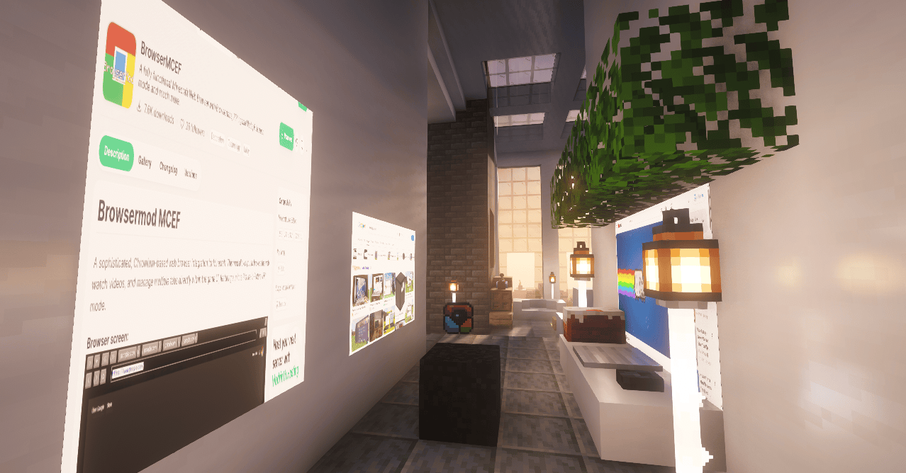
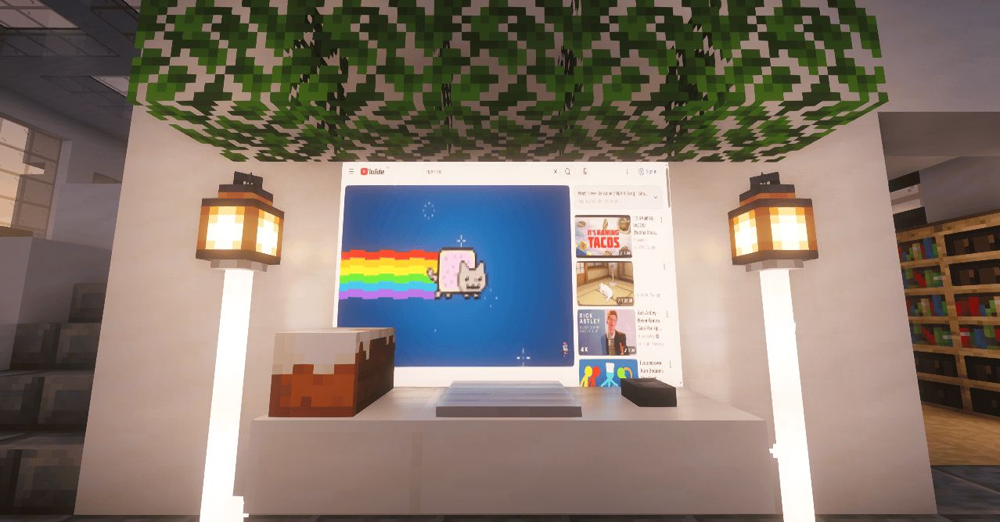
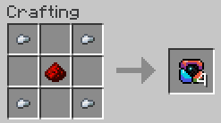

# Just A Browser Mod

> **This project is experimental and still in active development.**

**Just A Browser Mod** (JAB) adds live web screens to Minecraft. Build a wall of screen
blocks, run a command, and the wall becomes a real browser panel powered by an embedded
Chromium instance ([Rinku](https://github.com/Keksuccino/Rinku)).

## How It Works

**Server** stores screen data (URL, resolution, audio mode) in a `ScreenBlockEntity` on
the origin block of each wall. Commands (`/jab create`, `/jab url`, `/jab audio`) run
server-side and broadcast state to clients. The server never renders anything.

**Client** receives screen state over the network, creates Chromium browser instances via
Rinku, and renders their textures onto the wall blocks. Right-clicking with an empty hand
opens a browser GUI with a URL bar and full mouse/keyboard forwarding — edits round-trip
back to the server so all players see the same page in real-time. Browsing is session-only:
no cache, cookies wiped on every browser destroy.

**Multiplayer** — the wall display is shared. When any player navigates, the URL change is
broadcast to all tracking clients, who load the same page. Everyone sees the same content
simultaneously.

**Lifecycle** is distance-gated: browsers are created within `loadDistance` and destroyed
past `unloadDistance`, with a concurrent cap (`maxBrowsers`). Breaking any block destroys
the whole display. Browsers unload when chunks unload and recreate on reload. No idle
Chromium instances are preloaded.

## Features

- **Multiblock screen walls** — any rectangle of screen blocks (2x2 minimum) becomes a
  display, on any face of any side (walls, floors, ceilings).
- **Real browser rendering** — pages render onto blocks in-game with texture quality tied
  to GUI scale.
- **Interactive browser view** — right-click with an empty hand to open the browser GUI
  with a URL bar (`Ctrl+L` to focus) and full mouse/keyboard forwarding. In-page
  navigation (links, back/forward) works natively and stays in sync with the wall.
- **Shared displays** — all players on a server see the same page on a wall simultaneously.
- **Audio modes** — screens can be set to _global_ (page audio plays normally) or
  _dynamic_ (volume driven by your distance from the wall, 64-block falloff).
- **Per-face displays** — one wall can show a different page on each of its six faces.
- **Craftable** — 4 screen blocks per craft (iron nuggets + redstone). Breaks into an item
  without requiring a specific tool.

## Screenshots





## Crafting Recipe



1 Redstone dust and 4 Iron nuggets

## Requirements

- Minecraft **1.21.11** (Fabric)
- [Fabric API](https://modrinth.com/mod/fabric-api)
- [Rinku](https://github.com/Keksuccino/Rinku) (`rinku-fabric`, `3.0.4-1.21.11`)

> On first launch Rinku downloads its Chromium native binaries — this may take a few minutes.

## Usage

1. Craft screen blocks and build a flat wall (minimum 2x2).
2. Look at the wall and run:

```
/jab create                     # create a display on the face you're looking at
/jab create https://youtube.com # create and load a URL immediately
/jab url <url>                  # change the page on the wall you're looking at
/jab audio global|dynamic       # switch audio mode for the wall
/jab remove                     # remove the display
/jab debug                      # print server-side wall info for debugging
```

3. Right-click the wall with an **empty hand** to open the interactive browser view.

Breaking any block of a wall removes its display. Browsers are only active near the player
and automatically unload at a distance.

## Configuration

A `config/jab.properties` file is generated on first run:

| Key                  | Default                  | Description                                        |
| -------------------- | ------------------------ | -------------------------------------------------- |
| `maxScreenSize`      | `8`                      | Maximum wall dimension in blocks (max 32)          |
| `defaultResolutionX` | `1920`                   | Browser render width for new screens (max 7680)    |
| `defaultResolutionY` | `1080`                   | Browser render height for new screens (max 4320)   |
| `defaultUrl`         | `https://www.google.com` | Page loaded when a screen is created               |
| `loadDistance`       | `32`                     | Distance at which browsers are created (max 128)   |
| `unloadDistance`     | `48`                     | Distance at which browsers are destroyed (max 128) |
| `maxBrowsers`        | `16`                     | Concurrent browser cap (extra screens park)        |

## Performance

**Good:**

- Distance-gated lifecycle — browsers are only active near players and destroyed at a
  distance, keeping idle resource usage low.
- Max browser cap — `maxBrowsers` prevents runaway memory usage; excess screens park and
  resume when a slot opens.
- No idle preload — no Chromium instances exist until a screen is actually created.
- Chunk-aware — browsers unload when chunks unload and recreate on reload, avoiding wasted
  work in unloaded areas.
- Staggered creation — browsers spawn 2 per tick to avoid lag spikes when many screens
  load at once.
- Frustum-culled rendering — off-screen walls skip the render pass entirely.

**Not so good:**

- Each screen is a real Chromium instance — large walls or many simultaneous displays
  consume significant CPU and memory.
- First launch downloads Chromium binaries over the network, which may take several
  minutes.
- Chromium subprocesses persist until the JVM exits (they are not killed on disconnect
  or world change).
- Browser creation is async — after `/jab create`, there is a brief delay before the
  page appears on the wall.
- Dynamic audio mode injects JavaScript every 5 seconds for each audio screen, which
  adds minor per-tick overhead.

## Development

Just A Browser Mod is developed with significant AI assistance. The majority of the
codebase was generated through AI-assisted development workflows, with human oversight
for code review, verification, and build processes. All code is reviewed, tested, and
maintained by the project author.

## Building

```
./gradlew build
```

The built jar lands in `build/libs/`. Drop it (plus the requirements above) into your
`mods/` folder.

## Credits

- **[Just A Browser Mod](https://github.com/RenderHam/jab-mod)** by Renderham — the
  original mod (this project)
- **[Rinku](https://github.com/Keksuccino/Rinku)** by Keksuccino — the embedded
  Chromium framework that powers the browser rendering
- **[BrowserMod](https://github.com/Mcjunky33/BrowserMod)** by Mcjunky33 — the original
  in-game browser concept for Minecraft
- **[WebDisplays](https://github.com/CinemaMod/webdisplays)** by CinemaMod — multiblock
  screen walls in Minecraft
- **[Fabric API](https://github.com/FabricMC/fabric)** by FabricMC — the modding
  framework this mod is built on
- **[Minecraft](https://www.minecraft.net/)** by Mojang Studios — the base game

## License

This project is released under the [CC0 1.0 Universal](LICENSE) license.
